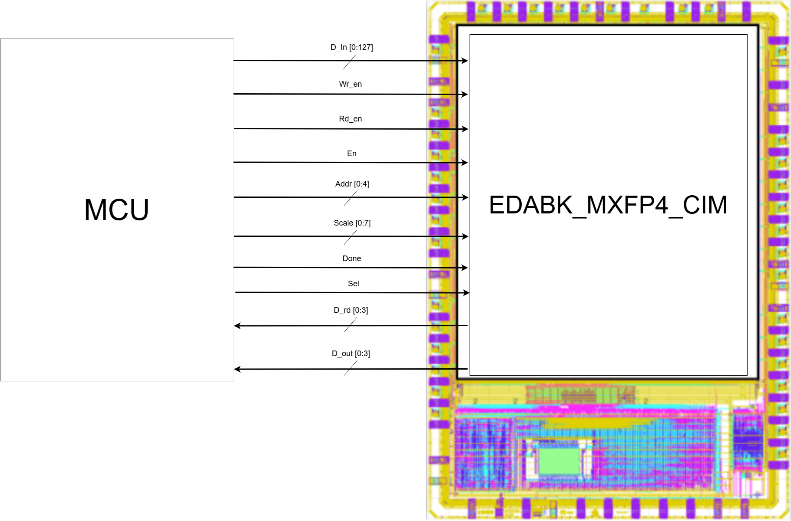
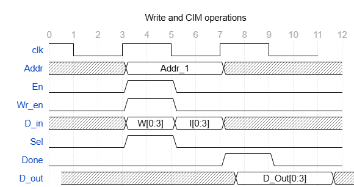
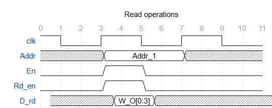

<table border="0">
  <tr>
    <td align="center" style="border: none;">
      
    </td>
    <td align="center" style="border: none; padding-left: 50px;">
      
    </td>
  </tr>
</table>

---

# EDABK_MXFP4_CIM

> This project, submitted to **Systems to Silicon Design Contest**, introduces a Compute-in-Memory Accelerator for MXFP4 GEMM, integrated and controlled by Caravel SoC Platform.

---

## Table of Contents
- [Abstract](#abstract)
- [Contributors](#contributors)
- [Documentation & Resources](#documentation--resources)
- [Prerequisites](#prerequisites)
- [System Block Diagram](#system-block-diagram)
- [Timeline](#timeline)
- [Checklist for Shuttle Submission](#checklist-for-shuttle-submission)

---

## Abstract

The advancement of Large Language Models (LLMs) demands hardware solutions capable of efficiently storing and processing large weight matrices while maintaining high throughput, energy, and area efficiency. One promising solution is adopting low-precision numerical formats. Standardized by the Open Compute Project (OCP) in early 2024, Microscaling floating-point numbers (MXFP) introduce a shared-scale mechanism that optimizes both computation and memory, improving AI workload efficiency. Specifically, MXFP4 (Microscaling 4-bit Floating-Point), which uses 4-bit floating-point elements with shared scaling, reduces storage and computation costs while maintaining a wide dynamic range.

The Microscaling Data Formats for Deep Learning study (2023) shows that MXFP4 can effectively replaces FP32 with minimal accuracy loss. On the GPT-2 (1.5B) model, Perplexity increases from 18.4 (FP32) to 18.7 (MXFP4). For ResNet-50, Top-1 accuracy is 75.9%, close to the 76.1% baseline. MXFP4 reduces storage and computation costs by up to 8x while maintaining stable performance for large Transformer and LLM models.

However, on the hardware side, efficiently supporting LLMs, particularly accelerator for General Matrix Multiplication (GEMM) using this format is challenging due to its unique representation and scaling, particularly in moving weights between memory and compute units. Compute-in-memory (CIM) solves this by performing operations within memory, reducing energy consumption and latency. MXFP4 is ideal for CIM, with its compact representation and shared scale mechanism enabling efficient weight storage and scaling.

Therefore, our team proposes **EDABK_MXFP4_CIM**, an architecture designed with the goal of performing the GEMM for the MXFP4 format using CIM. The overall architecture and activities' waveforms are described in the [System Block Diagram](#system-block-diagram) section. 

The key optimization of this design include the use of Compute-in-Memory (CIM) to reduce memory access time and improve efficiency by performing computations within memory. Additionally, results are accumulated before being quantized into MXFP4, preserving precision and ensuring better accuracy in high-precision tasks like General Matrix Multiplication (GEMM).

---

## Contributors

All members are affiliated to EDABK Laboratory, School of Electrical and Electronic Engineering, Hanoi University of Science and Technology (HUST).

| No. | Name                                                         | Study programme                           | Relevant link |
| --- | ------------------------------------------------------------ | ----------------------------------------- | ------------- |
| 1   | [Phuong-Linh Nguyen](mailto:linh.nguyenphuong1@sis.hust.edu.vn) | Master of Engineer in IC Design           |               |
| 2   | [Ngoc-Duong Nguyen](mailto:duong.nn242535m@sis.hust.edu.vn)     | Master of Science in IC Design            |               |
| 3   | [Hoang-Son Nguyen](mailto:son.nh210741@sis.hust.edu.vn)         | Bachelor in Electronics Engineering       |               |
| 4   | [Viet-Tung Pham](mailto:tung.pv224415@sis.hust.edu.vn)          | Senior student in Electronics Engineering |               |

---

## Documentation & Resources
For detailed hardware specifications and register maps, refer to the following official documents:

* **[Caravel Datasheet](https://github.com/chipfoundry/caravel/blob/main/docs/caravel_datasheet_2.pdf)**: Detailed electrical and physical specifications of the Caravel harness.
* **[Caravel Technical Reference Manual (TRM)](https://github.com/chipfoundry/caravel/blob/main/docs/caravel_datasheet_2_register_TRM_r2.pdf)**: Complete register maps and programming guides for the management SoC.
* **[ChipFoundry Marketplace](https://platform.chipfoundry.io/marketplace)**: Access additional IP blocks, EDA tools, and shuttle services.
* **[OCP Microscaling Formats (MX) Specification](https://www.opencompute.org/documents/ocp-microscaling-formats-mx-v1-0-spec-final-pdf)**: Detailed specifications of the Microscaling Formats.

---

## Prerequisites
Ensure your environment meets the following requirements:

1. **Docker** [Linux](https://docs.docker.com/desktop/setup/install/linux/ubuntu/) | [Windows](https://docs.docker.com/desktop/setup/install/windows-install/) | [Mac](https://docs.docker.com/desktop/setup/install/mac-install/)
2. **Python 3.8+** with `pip`.
3. **Git**: For repository management.

---

## System Block Diagram

---

## Timeline

---

## Checklist for Shuttle Submission
- [ ] Top-level macro is named user_project_wrapper.
- [ ] Full Chip Simulation passes for both RTL and GL.
- [ ] Hardened Macros are LVS and DRC clean.
- [ ] user_project_wrapper matches the required pin order/template.
- [ ] Design passes the local cf precheck.
- [ ] Documentation (this README) is updated with project-specific details.
